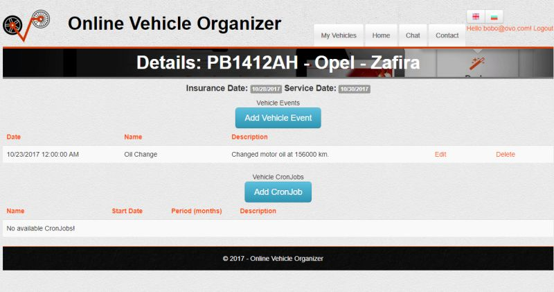

# OnlineVehicleOrganizer
Project for ASP.NET MVC course @ Telerik Academy

  

[Project Requirements](https://github.com/TelerikAcademy/ASP.NET-MVC/blob/master/resources/Final%20Project/2017/README.md)

| Name              | Academy Username  |
|-------------------|-------------------|
|Zhivko Ivanov      |__jorosoft__       |

## Description
 - Online web system for managing users vehicles data with multilangual(english and bulgarian) support. 

## Free Functionalities
 - Chat with other system visitors

## Admin Functionalities
 - Manage registered users(delete users, restore users and edit their role, view users info)
 - Manage vehicle manufacturers(add, edit, delete, restore)
 - Manage vehicle models(add, edit, delete, restore)
 
## User Functionalities
 - Manage theirs vehicles(add, edit, delete)
 - Manage vehicles events for every added vehicle(add, edit, delete)
 - Manage vehicles cronJobs for every added vehicle(add, edit, delete)
 - Receive notification emails 5 days before insurance or service check date comming 

-----------------------------------------------------------------------------------------------------------------------

-----------------------------------------------------------------------------------------------------------------------

## Used technologies
  - ASP.NET MVC 5
  - ORM - EntityFramework
  - Data base - SQL Server
  - Ioc container - Ninject 
  - Testing - NUnit, Telerik JustMock
  - Styles - Bootstrap 
  - Continuous Integration - AppVeyor & Jenkins
  - Code Coverage - Coveralls
  - Hosting - Azure
-----------------------------------------------------------------------------------------------------------------------
## Links

[Azure host link](http://ovoapp.azurewebsites.net//) |
